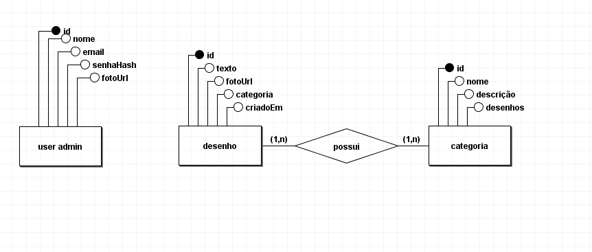
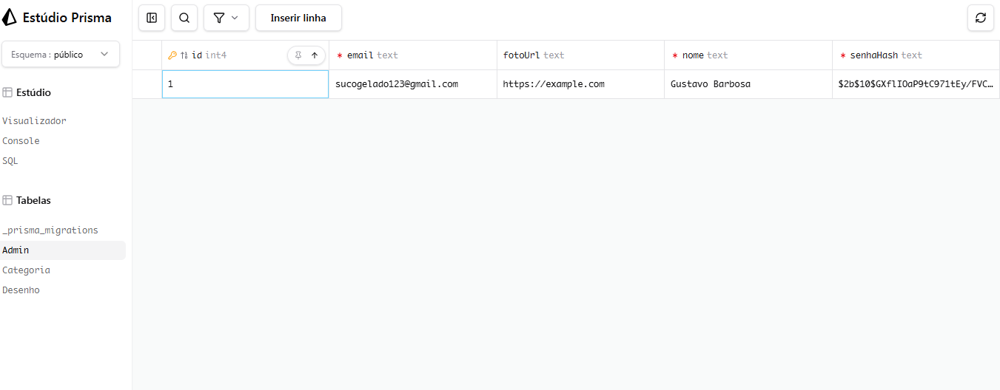
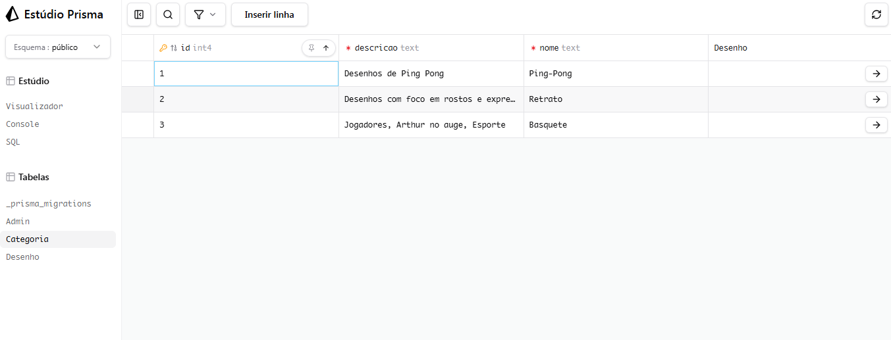
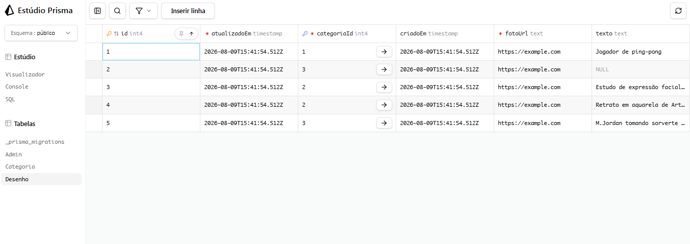

# tf-web-tema
# Bonde das poderosas

### Integrantes
[comment]: <> (
 Gustavo Barbosa Cardoso: https://github.com/Gust4v0-13,
 Jean Souza Santos: https://github.com/jss52-source, 
 Maria Clara Almeida Araújo: https://github.com/MariaClaraAlmeidaAraujo,
 Maria Clara Gomes Cardoso: https://github.com/MariaClaraGomesCardoso,
 Rebecca Rodrigues Camillozzi Guedes: https://github.com/RebeccaRCG1 )

# Galeria Virtual

### Descrição:
Uma pagina web para o compartilhamento de desenhos, obras e artes 
pessoais.

### Principais Funcionalidades
- Exibir imagens das obras feitas pelo artista.
- Exibir informações do artista, contato e outras redes sociais.

### Link de compartilhamento
- https://www.figma.com/design/Ys7UGsCBpJXofByr9nsipz/Wireframe-Web?t=umWJ7Mn98JXUaYz3-1

# Descrição do domínio

### Usuários
 
O sistema tem um único tipo de usuário: o administrador (Gustavo Barbosa), que utiliza a plataforma para publicar, organizar e manter seus desenhos e ilustrações.
 
### Problema que o sistema resolve
 
Essa Galeria Virtual tem a funçao de oferecer um lugar dedicado, sob meu total controle, onde posso publicar minhas obras organizadas por categoria.
 
# Modelo Conceitual
 

 
## Entidades
 
### user admin
Representa o administrador do sistema no caso, o próprio artista responsável pela galeria. Guarda os dados necessários para autenticação e identificação: id, nome, email, senhaHash, e fotoUrl.
 
### desenho
Representa cada obra publicada na galeria. Contém id, texto (descrição ou legenda da obra), fotoUrl, categoria (classificação temática da obra) e criadoEm (data decriação/publicação, usada para ordenar as obras cronologicamente).
 
### categoria
Representa os grupos temáticos usados para classificar os desenhos. Contém id, nome, descrição (explicação do que pertence a essa categoria) e desenhos.
 
### Relacionamentos
 
Desenho possui categoria (1,n) — (1,n): um desenho pode estar associado a uma ou mais categorias, e cada categoria pode conter um ou mais desenhos.

Observação sobre user admin: essa entidade não possui relacionamento com desenho ou categoria no modelo porque o sistema foi pensado
para um único administrador. Como não há múltiplos usuários publicando conteúdo, não existe a necessidade de registrar "quem criou o quê",todo o conteudo pertence ao único administrador existente.

## Diagrama Mermaid

    mermaiderDiagram

    ADMIN {
        Int id PK
        String nome
        String email UK
        String senhaHash
        String fotoUrl "opcional"
    }

    DESENHO {
        Int id PK
        String texto "opcional"
        String fotoUrl
        Int categoriaId FK
        DateTime criadoEm
        DateTime atualizadoEm
    }

    CATEGORIA {
        Int id PK
        String nome
        String descricao
    }

    CATEGORIA ||--o{ DESENHO : "possui"

## Banco de Dados Populado (Prisma Studio)

### Admin

### Categoria

### Desenho

